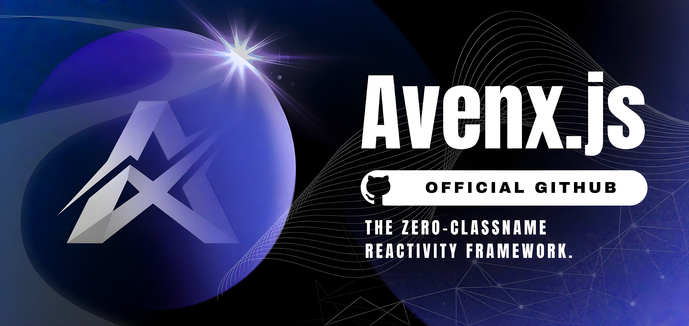

# Avenx.js

## The lightweight, zero-dependency reactive frontend framework.

Build modern web applications with a compiler-driven architecture, Proxy-powered reactivity, scoped styles, and first-class developer tooling — without the runtime overhead.

🌐 [**Website**](https://avenx-js.com) &nbsp;•&nbsp;
📚 [**Docs**](https://docs.avenx-js.com) &nbsp;•&nbsp;
🧪 [**Dev**](https://dev.avenx-js.com) &nbsp;•&nbsp;
📝 [**Blog**](https://blog.avenx-js.com) &nbsp;•&nbsp;
📊 [**Benchmarks**](https://benchmarks.avenx-js.com) &nbsp;•&nbsp;
📈 [**Coverage**](https://coverage.avenx-js.com) &nbsp;•&nbsp;
💬 [**Discord**](https://discord.avenx-js.com)

---

## ✨ Why Avenx.js?

Avenx.js is built around a simple idea:

> **Frontend development should be powerful without being unnecessarily complex.**

Instead of relying on a large client-side runtime, Avenx.js moves as much work as possible into the compiler.

| **Feature** | **Description** |
|---|---|
| ⚡ **Lightweight** | Minimal runtime with zero production dependencies |
| 🧠 **Reactive by design** | Proxy-driven state management with automatic updates |
| 🎨 **Scoped CSS** | Component styles stay isolated without extra libraries |
| 🛠️ **Built-in CLI** | Generate, build, serve, and manage your application from one CLI |
| 📦 **Compiler-driven** | More work at build time, less work in the browser |
| 🧩 **Component-based** | Build applications from small, reusable components |
| 🔍 **Developer-focused** | Designed with a straightforward and predictable development experience |

---

## 📉 Zero Runtime Dependencies

Avenx.js aims to keep the production footprint as small as possible.

- No large dependency tree.
- No unnecessary runtime abstractions.
- Just the code your application needs.

---

## 📊 Performance

Performance is a first-class goal of Avenx.js.

We maintain public benchmarks to make the framework's performance transparent and continuously track changes across releases.

👉 [Avenx.js Benchmarks](https://benchmarks.avenx-js.com)

---

## 🧪 Code Quality

Avenx.js is continuously tested through automated CI pipelines with code coverage and other quality checks.

👉 [View Code Coverage](https://coverage.avenx-js.com)

---

## 🌱 Community

Avenx.js is an open-source, community-driven project.

Whether you want to fix a bug, improve the documentation, propose a feature, or simply experiment with the framework — contributions are welcome.

#### 🤝 Contribute

1. Fork the repository
2. Create a branch
3. Make your changes
4. Add or update tests where appropriate
5. Open a Pull Request

Good first issues and help-wanted issues are a great way to get started.

👉 [Explore Issues](https://github.com/Avenx-JS/avenx-js/issues)

---

## 💬 Join the Community

Have a question, want to share what you're building, or just want to meet other Avenx.js developers?

Join the community:

💬 [Discord](https://discord.avenx-js.com)

---

## 🚀 Build fast. Stay simple. Ship with Avenx.js.

Made with ❤️ by the Avenx.js community.

